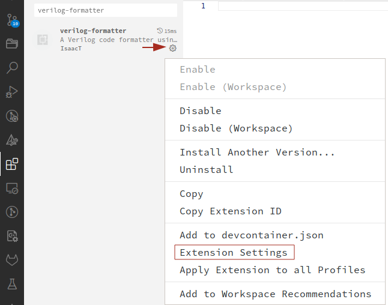

# Contributing Guidelines
To keep the style of the project consistent, please follow the described guidelines when contributing.

## Make/CMake
This project uses `CMake` as buildsystem, so for any addition of modules the corresponding `CMake` files should be modified when necessary.

## Code Format
The formatting rules of the modules are enforced by [istyle-verilog-formatter](https://github.com/thomasrussellmurphy/istyle-verilog-formatter) using (Git Hooks)[https://git-scm.com/book/en/v2/Customizing-Git-Git-Hooks]. If using Visual Studio Code, the extension [verilog-formatter](https://marketplace.visualstudio.com/items?itemName=IsaacT.verilog-formatter), which is a wrapper around the `istyle-verilog-formatter`, can also be used to enforce the same options passed to the hook while writting code. We provide the `.iStylerc` file that matches our format of preference. The configuration steps for Visual Studio Code can be found below:
- Install the [verilog-formatter](https://marketplace.visualstudio.com/items?itemName=IsaacT.verilog-formatter) extension and **its dependencies** as described in its information page.
- Select the `Extension Settings` option from the drop-down menu of the extension (see image below).

  

- Set `Verilog-formatter > Istyle: Path` to the path of your local `iStyle`, although if you followed its installation guide it should be `/usr/bin/iStyle`.
- Set `Verilog-formatter > Istyle: Args` to `--options=/path/to/Abejaruco/.iStylerc`.

If you don't use VScode for formatting and thus you run `iStyle` manually, just invoke it with the same arguments that we have set up for VScode.

## Code Style Conventions
- Keep a minimal amount of comments. Only add comments when it's really necessary to clarify some part of the code.

## Module and Variable Naming Conventions
- Use `PascalCase` for modules definitions.
- Use `PascalCase` ended in `_tb` for testbenches (e.g. `BaseMultiplier_tb`).
- Use `CAPSLOCK` to name parameters.
- Use `snake_case` to name variables and functions.

## File and Directory Naming Conventions
- Top-level directories use `snake_case`.
- Modules names use `snake_case` and with `.v` extension.
- Test modules names use `snake_case` and with `.tb.v` extension.
- Documents names, either in PDF or Markdown format, should use `PascalCase`.
- Files for which a convention already exists (e.g. `README.md`, `LICENSE.md`, `CMakeLists.txt`, etc) should follow that convention.
- CMake dependencies that are automatically downloaded should be configured with an individual file in the `cmake/Dependencies` folder. The file name should correspond to the package name that we need (e.g. if we want to find the package `verilator`, the file name should be that one, not `Verilator`, which is the name that appears in the main README at the github repository) or the name of the utility we want to install (e.g. `iverilog`). The name of the dependency to be fetched should be included where corresponds inside the `Dependencies.cmake` file.
- CMake modules names should use `PascalCase` and be included inside the `cmake/Modules` folder.
